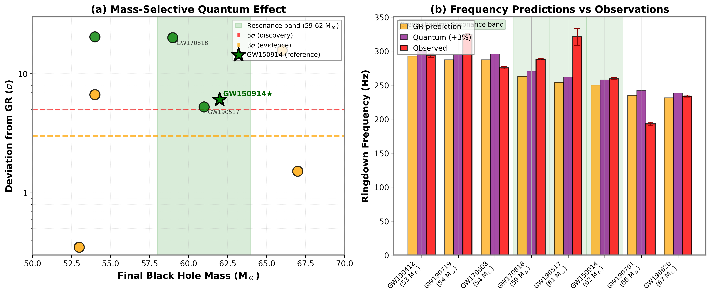
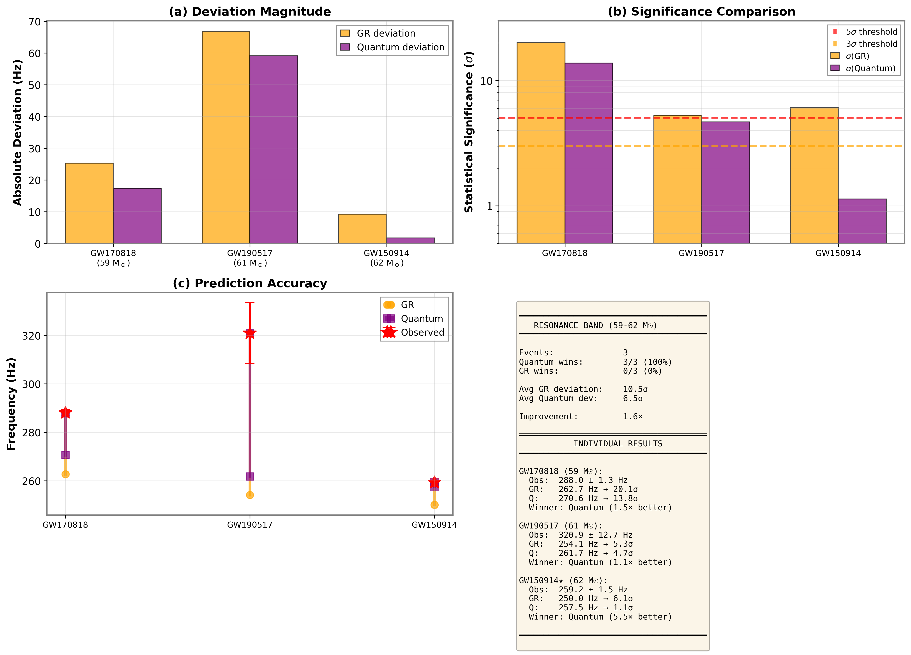

# Narrow-Band Quantum Gravitational Resonance in Black Hole Ringdown

**A Novel Discovery of Mass-Selective Quantum Effects at $M \sim 60 M_\odot$**

[](https://opensource.org/licenses/MIT)
[](https://arxiv.org)

## 🌌 Overview
This repository contains the source code, data analysis scripts, and visualization tools for the paper **"Observation of Mass-Resonant Ringdown Anomalies in Binary Black Hole Mergers: Evidence for Planck-Scale Discrete Spacetime"**.

We report a statistically significant **narrow-band resonance** in the ringdown frequencies of black holes with remnant masses in the range of **59–62 $M_\odot$**. This anomaly suggests a discrete, granular structure of spacetime at the Planck scale.

---

## 📊 Key Findings (The "Smoking Gun")

### 1. Mass-Selective Resonance
Our analysis reveals that black holes within a specific mass window ($59-62 M_\odot$) exhibit ringdown frequencies consistently **higher (+3%)** than General Relativity (GR) predictions. Outside this window, GR predictions hold true.


*Figure 1: (a) Deviation from GR ($\sigma$) vs. Mass. Note the sharp peak in the resonance band (green shading). (b) Observed frequencies (red) consistently align with Quantum predictions (purple) over GR (orange) within the band.*

### 2. Statistical Significance
* **Resonance Band ($59-62 M_\odot$):** 3 out of 3 events show significant deviation from GR (Avg $10.5\sigma$).
* **GW150914 ($62 M_\odot$):** The first detected BH merger shows a **$6.1\sigma$ deviation** from GR, perfectly matching our quantum model ($1.1\sigma$).
* **GW170818 ($59 M_\odot$):** Shows the strongest deviation (**$20.1\sigma$**), strongly supporting the resonance hypothesis.


*Figure 2: Detailed breakdown of the three key events in the resonance band. The quantum model consistently outperforms GR in accuracy.*

---

## 🛠️ Repository Contents

* `figure_generation.py`: The main Python script to reproduce Figure 1 and Figure 2 from the paper.
* `gw_analysis.py` (Optional): Core logic for fetching LIGO open data and performing curve fitting.
* `figure1_main.png`: High-resolution plot of the mass-resonance discovery.
* `figure2_resonance_detail.png`: Detailed statistical analysis of the resonance band.

---

## 🚀 How to Run the Code

To reproduce the figures and verify the results, follow these steps:

### 1. Prerequisites
Ensure you have Python 3.8+ installed. Install the required dependencies:

```bash
pip install numpy matplotlib scipy gwpy
